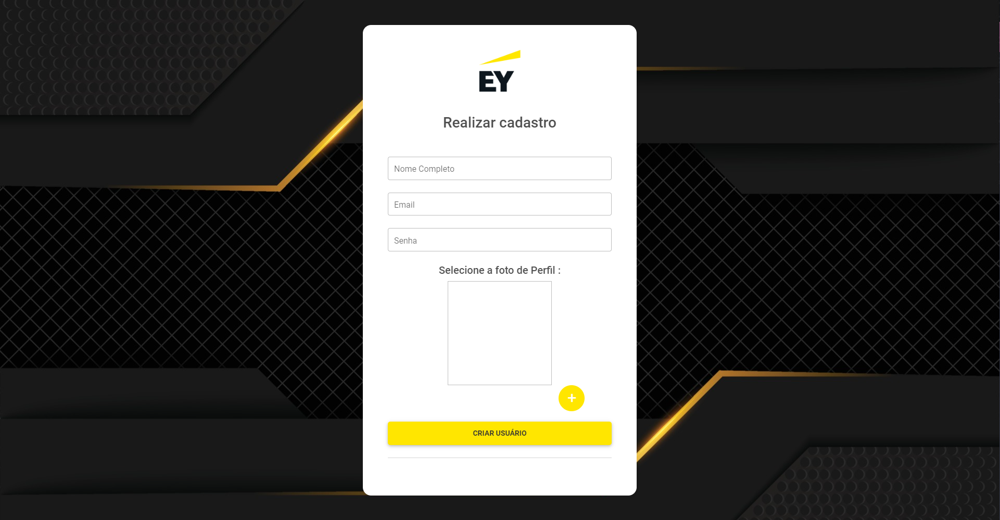
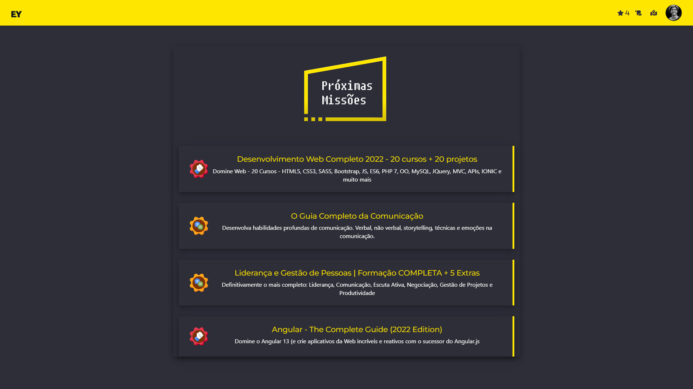
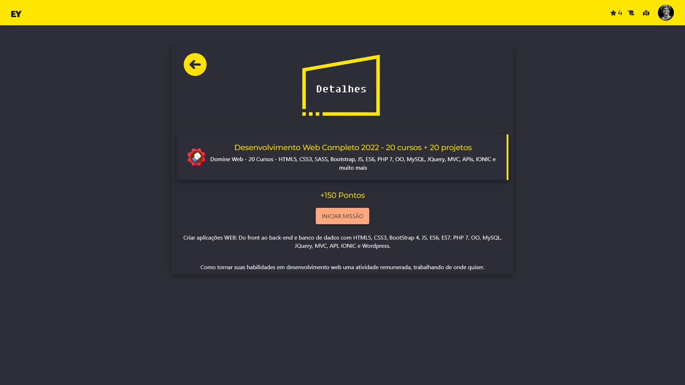
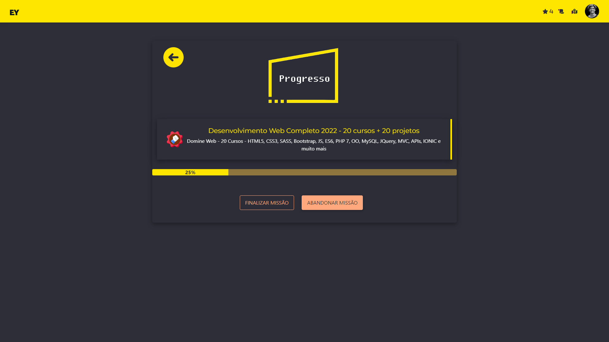
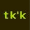

# ChallengeEY

| **Alunos**                           | **RMs**   |
|                 :---:                |   :---:   |
|**Atila da Silva Gonçalves Moura**    | **82676** |
|**Carlos Eduardo de Castro Henriques**| **81945** |
|**Ian Makdisse**                      | **82205** |
|**Jair Urbano da Silva Junior**       | **82733** |
|**Leonardo da Rocha Leite Antonio**   | **81878** |

<!--TODO: Pegar o RM do pessoal. -->

**Turma: A**

**Ano: 4 SI**

## Objetivo / descrição do Projeto
Temos a missão de gameficar o processo de seleção de candidatos, então fizemos um website de **_missões (cursos)_** com ranks de iniciante até expert, o rank é atribuído com base na quantidade de pontuações que recebe de acordo com as **_missões_** que ele aceita e são concluídas.
## Diagrama do projeto

### Arquitetura
* **Ainda em desenvolvimento**
### Imagem utilizada







## Como usar 

Execute o app:

* Instale o [NODE.js](https://nodejs.org/en/download/)
* Instale as seguintes bibliotecas
```cmd
npm install --save express

npm install --save express-handlebars

npm install body-parser --save

npm i -g nodemon

npm install --save sequelize

nodemon app.js

npm install --save mysql2

npm install --save cors

npm install --save express-session

npm install --save connect-flash

npm install --save bcryptjs

npm install --save passport

npm install --save passport-local
```
* rode utilizando `node app.js` ou `nodemon app.js`
* Pronto > Você acaba de executar o aplicativo de gameficação de processo de seleção 😄

Como clonar o repositório:

~~~wsl2   
    cd /home/Challenge
    git clone https://github.com/atila9595/ChallengeEY.git
    cd ChallengeEY
    ls
~~~
## Vídeo demonstrativo

[](https://youtu.be/HFOk3cagoPs)

## Referências 

* [Passport](https://www.passportjs.org/)
* [Sequelize](https://sequelize.org/)
* [Nodemon](https://www.npmjs.com/package/nodemon)
* [Handlebars](https://handlebarsjs.com/guide/)


---
 **_[ Takaka ]_** 
