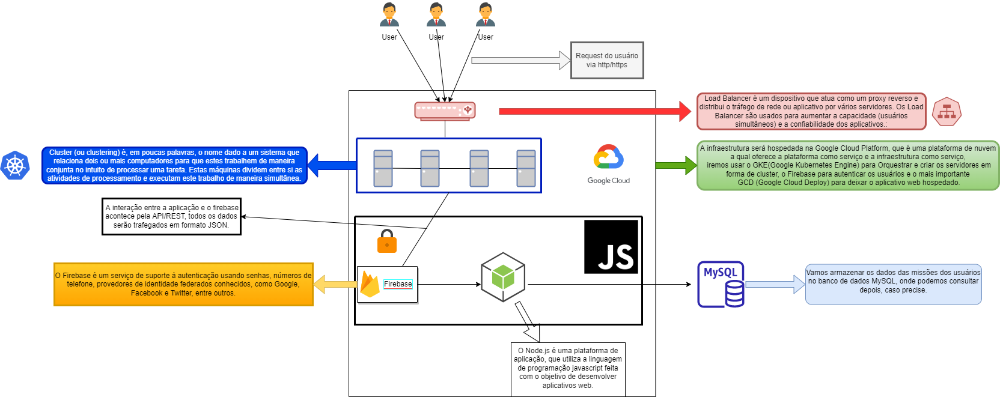
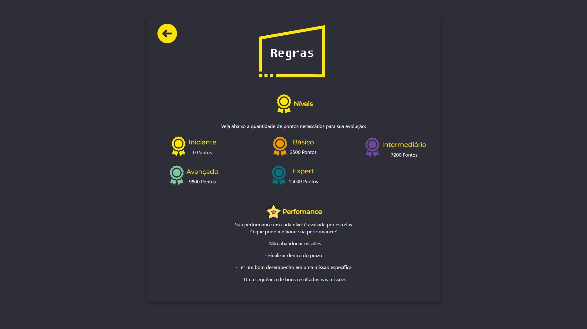

# ChallengeEY

| **Alunos**                           | **RMs**   |
|                 :---:                |   :---:   |
|**Atila da Silva Gonçalves Moura**    | **82676** |
|**Carlos Eduardo de Castro Henriques**| **81945** |
|**Ian Makdisse**                      | **82205** |
|**Jair Urbano da Silva Junior**       | **82733** |
|**Leonardo da Rocha Leite Antonio**   | **81878** |

<!--TODO: Pegar o RM do pessoal. -->

**Turma: A**

**Ano: 4 SI**

## Objetivo / descrição do Projeto
Nosso projeto tem por objetivo direcionar o usuário durante sua caminhada pelo processo de desenvolvimento pessoal e profissional, tanto na pré-seleção como durante sua jornada, no treinamento da EY.
Partimos do princípio de que tanto o material de formação técnica quanto de desenvolvimento de soft-skills já existe e está em uso na EY, nos treinamentos que ela fornece.
Na nossa solução levamos em consideração que a oferta de cursos ou workshops que agradam o usuário tende a favorecer e incentivar o usuário a continuar no seu percurso de treinamento.
Para isso criamos a ideia de que o usuário terá missões a serem cumpridas. Missões que pode ou não rejeitar. Em função dessas escolhas o algoritmo irá se adaptando e fará outras ofertas de missões. Sempre de 3 em 3 missões. Se uma missão for abandonada, outra aparecerá dentre as três escolhidas pelo algoritmo e substituirá apenas a que acabou de ser abandonada.
Uma vez escolhida uma missão o usuário pode concluí-la ou abandoná-la. Isso influencia tanto na sua performance durante as fases como na forma como o algoritmo vai sortear as próximas missões.
Existe uma tela na qual o usuário pode ver uma recapitulação das regras do jogo.
Gráficos em radar mostram a evolução do usuário, tanto no desenvolvimento dos hard-skills como dos soft-skills.
No perfil do usuário podemos ver sua evolução no percurso do treinamento. As cores indicam o nível em que ele se encontra, assim como a barra de progressão deixa clara a porcentagem que já percorreu naquele nível. As estrelas indicam a forma como evoluiu durante a passagem pelas missões. Podemos também ver o percurso que já foi trilhado pelo usuário. Lá ele tem o detalhamento da sequência em que fez os treinamentos.

## Diagrama do projeto

### Arquitetura
 A infraestrutura será hospedada na Google Cloud Platform, que é uma plataforma de nuvem a qual oferece a plataforma como serviço e a infraestrutura como serviço, iremos usar o GKE(Google Kubernetes Engine) para Orquestrar e criar os servidores em forma de cluster, o Firebase para autenticar os usuários e o mais importante GCD (Google Cloud Deploy) para deixar o aplicativo web hospedado.
Temos o Load Balancer que é um dispositivo que atua como um proxy reverso e distribui o tráfego de rede ou aplicativo por vários servidores.
Os Load Balancer são usados ​​para aumentar a capacidade (usuários simultâneos) e a confiabilidade dos aplicativos.
O Cluster (ou clustering) é, em poucas palavras, o nome dado a um sistema que relaciona dois ou mais computadores para que estes trabalhem de maneira conjunta no intuito de processar uma tarefa. Estas máquinas dividem entre si as atividades de processamento e executam este trabalho de maneira simultânea.
O Cluster se comunicará com o Firebase e a interação entre a aplicação e o firebase acontece pela API/REST, todos os dados serão trafegados em formato JSON.
O Firebase é um serviço de suporte à autenticação usando senhas, números de telefone, provedores de identidade federados conhecidos, como Google, Facebook e Twitter, entre outros.
Após a autenticação o Firebase redireciona os usuários para o Node.js .  O Node.js é uma plataforma de aplicação, que utiliza a linguagem de programação javascript feita com o objetivo de desenvolver aplicativos web. O Node.js é baseado em eventos, é um loop de eventos com thread único. A thread Principal é responsável pela parte síncrona da  aplicação, para parte assíncrona é alocado pela thread principal, uma thread em segundo plano para processar a operação. O nó é chamado de thread único pois todas as solicitações são recebidas nele, apesar de termos vários processos rodando em segundo plano são  sempre controlados pelo thread principal.Nós escolhemos o Node.js pois é uma aplicação que atende a maturidade técnica da equipe, visto que se trabalha em javascript, possuindo fácil integração com várias ferramentas de nuvem e além disso é muito leve, economizando muito o valor de infraestrutura. Além disso, temos um ecossistema grande em javascript, isso nos permite trabalhar com inúmeras bibliotecas e frameworks para o node.js.
 A nossa aplicação está usando uma biblioteca que cria modelos de página web reutilizáveis, chamada Handlebars. A escolha do Handlebars se deve a organização pois ele separa os modelos de negócio e os templates, deixando a página mais limpa e com isso melhorando a capacidade de manutenção e escalabilidade do aplicativo. A nossa arquitetura será Orientada a eventos, pois teremos vários eventos e gamificação, com isso criaremos pontuações sendo assim precisamos executar processos assincronos que nos de intervalos de tempo confiáveis entre a chamada e a resposta.

### Desenho Da Arquitetura


### UX





### Protótipo Não Funcional
[Nesse Link](https://xd.adobe.com/view/8b57abfc-7e1a-447c-9683-856d348cc463-de04/?fullscreen)

## Como usar

Execute o app:

* Instale o [NODE.js](https://nodejs.org/en/download/)
* Instale as seguintes bibliotecas
```cmd
npm install --save express

npm install --save express-handlebars

npm install body-parser --save

npm i -g nodemon

npm install --save sequelize

nodemon app.js

npm install --save mysql2

npm install --save cors

npm install --save express-session

npm install --save connect-flash

npm install --save bcryptjs

npm install --save passport

npm install --save passport-local
```
* Configuração do banco de dados local
    * no workbench do **_MySQL_**  crie um **_Schema_** chamado `challengeey`
    * no arquivo db.js localizado no caminho **_`ChallengeEY/models/db.js`_** troque as seguintes informações:
        ```js
        const sequelize = new Sequelize('challengeey', 'username', 'senha', {
            host: 'localhost',
            dialect: 'mysql'
        })
        ```
    * sendo username, o usuario do seu banco de dados e senha, a senha do seu banco de dados
    * em **_`ChallengeEY/models/missao-model.js`_** e em **_`ChallengeEY/models/usuario-model.js`_** descomente as seguintes linhas:
        ```js
            Usuaro.sync({ force: true })

            Missao.sync({ force: true })
        ```
    * rode utilizando `node app.js` ou `nodemon app.js`
    * isso criará as tabelas no banco de dados
    * pare de rodar o app utilizando `Ctrl + C`
    * comente novamente
    ```js
        //Usuaro.sync({ force: true })

        //Missao.sync({ force: true })
    ```
    * nos diretórios **_`ChallengeEY/models/missao-model.js`_** e **_`ChallengeEY/models/usuario-model.js`_**
* rode novamente utilizando `node app.js` ou `nodemon app.js`
* Pronto > Você acaba de executar o aplicativo de gameficação de processo de seleção 😄

Como clonar o repositório:

~~~wsl2   
    cd /home/Challenge
    git clone https://github.com/atila9595/ChallengeEY.git
    cd ChallengeEY
    ls
~~~
## Vídeo demonstrativo

[](https://youtu.be/PqJC4B5rqRE)

## Referências

* [Passport](https://www.passportjs.org/)
* [Sequelize](https://sequelize.org/)
* [Nodemon](https://www.npmjs.com/package/nodemon)
* [Handlebars](https://handlebarsjs.com/guide/)


---
 **_[ Takaka ]_**
